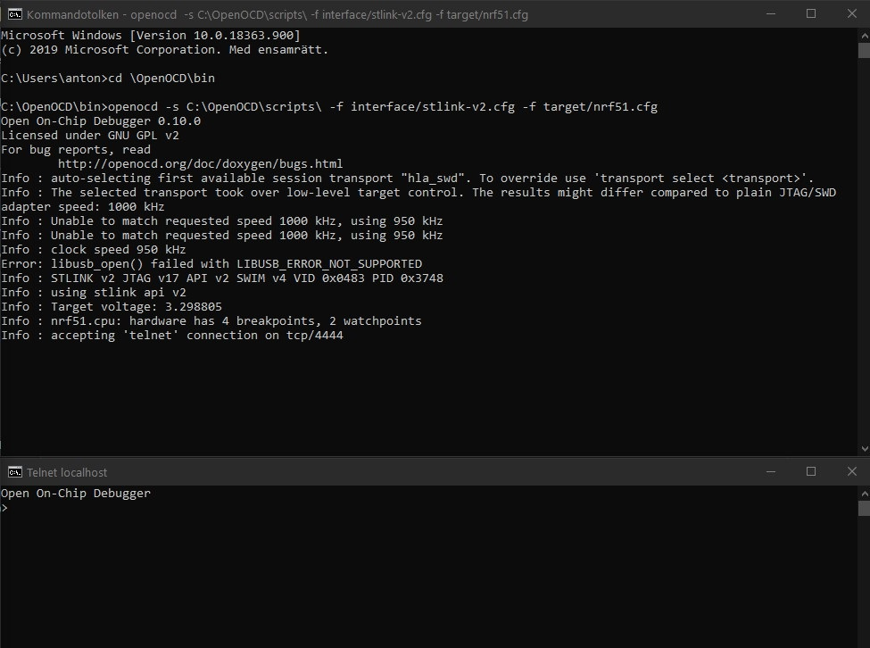
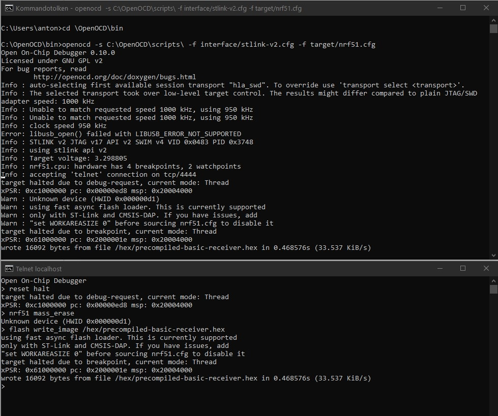

## Gallium Keyboard

The Gallium Keyboard is a Wireless Ergonomical Split Keyboard.

## Summary

  - [Bill of materials](#bill-of-materials)
  - [Transmitters Assembly](#transmitters-assembly)
  - [Receiver Assembly](#receiver-assembly)
  - [Firmware](#firmware)
  - [Battery usage](#battery-usage)

## Bill of materials

#### Transmitters

| Qty | Item                                          | Notes                                               |
|----:|-----------------------------------------------|-----------------------------------------------------|
|  62 | Cherry MX compatible switches                 |                                                     |
|  62 | Kailh MX hot swap sockets (optional)          |                                                     |
|   2 | Gallium Wireless PCBs                         |                                                     |
|   2 | YJ-14015 modules (Core51822B clones)          | [aliexpress or ebay](https://www.aliexpress.com/item/NRF51822-Core51822-BLE-4-0-Bluetooth-2-4G-Wireless-Module-Antenna-Board-For-ULP-SPI-I2C/32842154172.html?spm=2114.search0104.3.8.663a616aYeRlVr&ws_ab_test=searchweb0_0,searchweb201602_1_10065_10068_10843_10059_10884_10887_10696_100031_10084_10083_10103_10618_10304_10307_10820_10821_10302,searchweb201603_60,ppcSwitch_5&algo_expid=1dded059-5054-4890-bcc4-6face1150a21-1&algo_pvid=1dded059-5054-4890-bcc4-6face1150a21&priceBeautifyAB=0)
|  62 | 1N4148 diodes                                 | SMD 1N4148 SOD-123 diodes can also be used          |
|   2 | Keystone 3034 SMT battery holders             | [digikey](https://www.digikey.com/product-detail/en/keystone-electronics/3034/36-3034-ND/4499289)|
|   2 | PCM12SMTR SMT slide switches                  | [digikey](https://www.digikey.com/product-detail/en/c-k/PCM12SMTR/401-2016-1-ND/1640125)|
|   2 | Right angle 0.1" header (1x4pin)              |                                                     |

#### Receiver

| Qty | Item                                          | Notes                                               |
|----:|-----------------------------------------------|-----------------------------------------------------|
|   1 | Redox receiver PCB                            |                                                     |
|   1 | YJ-14015 module (Core51822B clone)            | [aliexpress or ebay](https://www.aliexpress.com/item/NRF51822-Core51822-BLE-4-0-Bluetooth-2-4G-Wireless-Module-Antenna-Board-For-ULP-SPI-I2C/32842154172.html?spm=2114.search0104.3.8.663a616aYeRlVr&ws_ab_test=searchweb0_0,searchweb201602_1_10065_10068_10843_10059_10884_10887_10696_100031_10084_10083_10103_10618_10304_10307_10820_10821_10302,searchweb201603_60,ppcSwitch_5&algo_expid=1dded059-5054-4890-bcc4-6face1150a21-1&algo_pvid=1dded059-5054-4890-bcc4-6face1150a21&priceBeautifyAB=0) |
|   1 | Arduino 5v 16MHz Pro Micro compatible microcontroller  | [aliexpress or ebay]                                |
|   1 | 1117 3.3v regulator in SOT223                 | [digikey](https://www.digikey.com/product-detail/en/diodes-incorporated/AZ1117IH-3.3TRG1/AZ1117IH-3.3TRG1DICT-ND/5699682)|
|   2 | 330 Ohm 0805(2012 metric) SMD resistors       | Default configuration. Values depends on LED color, see [below](#resistor-values)|
|   2 | 220 Ohm 0805(2012 metric) SMD resistors       | Default configuration. Values depends on LED color, see [below](#resistor-values)|
|   3 | 1.5k Ohm 0805(2012 metric) SMD resistors      | Default configuration. See [below](#resistor-values)|
|   1 | Red 0805(2012 metric) SMD standard LED        | Default configuration.                              |
|   1 | Blue 0805(2012 metric) SMD standard LED       | Default configuration.                              |
|   1 | Green 0805(2012 metric) SMD standard LED      | Default configuration.                              |
|   1 | White 0805(2012 metric) SMD standard LED      | Default configuration.                              |
|   1 | Through hole momentary switch                 | Dimensions 6mm x 6mm x 4.3mm                        |
|   1 | Right angle 0.1" header (1x4pin)              |                                                     |
|   2 | Straight hot swap 0.1" header (1x6pin)        | Use wire from diods as legs                         |

> :information_source: You can also use the [Mitosis receiver](https://github.com/reversebias/mitosis-hardware/blob/master/bom/README.md) since it's almost identical, or you can build a receiver on your own. 

> :warning: To program the YJ-14015 MCUs you need an ST-Link v2 programmer, these can be found on eBay or Aliexpress for as little as 2$ shipped. See [picture below](#nordic-mcus-firmware).

##### Resistor values

If you want to customize your LEDs color or save a few bucks by ordering the LED all the same color you can refer to this section for choosing the correct resistor values. Otherwise you can refer to the [default configuration](#default-configuration).

There are two sets of resistor that you need for the receiver.

- The voltage divider resistors (`R1`, `R2` and `R3`): anything between 1.5k Ohm and 4.7k Ohm is good.
- The LEDs resistors (`R4`,`R6`,`R7` and `R8`): see the following table.

| LED color | Vf   | Suggested resistor value |
|-----------|------|--------------------------|
| Red       | 1.7V | 330 Ohm                  |
| Yellow    | 2.1V | 330 Ohm                  |
| Blue      | 3.2V | 220 Ohm                  |
| Green     | 2.2V | 330 Ohm                  |
| White     | 3.6V | 220 Ohm                  |

Depending on the color you choose to use you should use the resistor listed above.

#### Default configuration

Here you can find the default configuration for the receiver assembly.

| Label | Component         |
|-------|-------------------|
| D1    | Red LED           |
| D2    | Blue LED          |
| D3    | Green LED         |
| D4    | White LED         |
| R4    |  330 Ohm resistor |
| R6    |  220 Ohm resistor |
| R7    |  330 Ohm resistor |
| R8    |  220 Ohm resistor |
| R1    | 1.5k Ohm resistor |
| R2    | 1.5k Ohm resistor |
| R3    | 1.5k Ohm resistor |

## Transmitters Assembly

<p align="center">

</p>

Assembly steps:

- Solder components to PCBs.
  1. Solder slider switch. 
  2. Solder the YJ-14015 on the same side as the slider switch.
  3. Solder 1N4148 diodes either SMT or THT (Surface-mount Technology or Through-hole Technology).
  4. Apply insulating tape over the pads surrounding the battery ground pad before soldering the battery holder [picture below](#battery-holder-installation-detail).
  5. Some solder is needed on the ground pad to contact properly with the battery. See [picture below](#battery-holder-installation-detail).
  6. Solder the battery holders.
  7. If you use the onboard CR2032 battery holder then bridge the jumper JP_BAT1 to either R or L depending on wich side the battery is located on. See [picture below](#bridge-jumper).
     (This is not needed if you use external battery pinout EXT-BAT)
  8. Solder the programming headers.
  9. (Optional) Solder Kailh Hot Swap Sockets
- Fit the PCBs inside their cases.
- Add the switches to the plate.
- Solder switches to the PCB.
- Add the CR2032 batteries.
- Program the MCUs.
- Close the case.

##### How i solder surface mount components:
Wet one pad with solder.
Position the component and hold the component in place with a tweezer.
Heat up the wet pad and let cool, this should fix the component.
Re-heat and adjust the position if the component isn't placed perfect.
Be sure not to heat to long wich may damage the PCB or the component.
Solder the rest of the pads like normal.


##### Programming headers detail:

<p align="center">

</p>

##### MCUs detail:

<p align="center">

</p>

##### Slider switch detail:

<p align="center">

</p>

##### Diodes installation detail:

<p align="center">

</p>
SMT on the left and THT on the right.

##### Battery holder installation detail:

<p align="center">


</p>

##### Left and right hand completed assembly:

<p align="center">

</p>

##### Assembled PCB:

<p align="center">

</p>

## Receiver Assembly

The receiver assembly is pretty straightforward, you can install the components in any order you like with the exception of the YJ-14015: it should be installed **after** the right angled header (PROGR_HEADER1). Suggested assembly order:

1. Solder D1, D2, D3 and D4 LEDs. See [image](#leds-installation-detail) for orientation.
2. Solder R4, R6, R7 and R8 resistors.
3. Solder R1, R2 and R3 resistors.
4. Solder the AMS1117.
5. Solder the Arduino Pro Micro headers.
6. Solder the programming headers. I suggest you to cut the excess of the header **before** soldering the headers. You should stay as flush to the PCB surface as possible since the controller will be soldered above the headers. Use some masking tape to help you keep the header in place while soldering.
7. Solder the YJ-14015. I suggest you to glue it in place or use some masking tape to help you during soldering.
8. Upload the firmware and you're done.

##### Assembled PCB, front:

<p align="center">

</p>

##### Assembled PCB, back:

<p align="center">

</p>

##### LEDs installation detail:

<p align="center">

</p>

> :information_source: Please note that here I installed 220 Ohm resistors because I used only blue and white LEDs as I only had those laying around. You should use the resistor values suggested [here](#resistor-values) or follow the [default configuration](#default-configuration).

## Firmware

**Basics**: The Gallium keyboard works similarly to the [Mitosis keyboard](https://github.com/qmk/qmk_firmware/tree/master/keyboards/mitosis): we have two transmitters responsible for scanning the two matrices, which then transmit the matrix status through the [Gazel protocol](https://developer.nordicsemi.com/nRF5_SDK/nRF51_SDK_v5.x.x/doc/5.2.0/html/a00140.html) to the receiver. The receiver is another YJ-14015 which receives the two matrix scans and send it through serial to the Arduino Pro Micro. The Pro Micro is responsible for running QMK and converting the bytes received by the YJ-14015 into actual keystrokes.

Firmware sources available here: [https://github.com/slavfot/gallium-firmware](https://github.com/slavfot/gallium-firmware).

You'll need to upload the firmware to the corresponding MCUs as per the following diagram:

<p align="center">

</p>

Note that you'll need to upload the firmware for the YJ-14015 only once. Everything related to the keymap is handled by the Arduino Pro Micro and QMK Firmware, that's what you will need to modify to update the keymap.

### Step-by-step firmware upload guide

#### Arduino Pro Micro Firmware upload

Let's start by uploading the QMK firmware on the Arduino, this will help us in diagnosing problems early on. The Gallium uses QMK for its firmware, follow the QMK installation instructions [here](https://docs.qmk.fm/#/getting_started_build_tools), then compile and burn the firmware as follows:

```sh
$ cd path/to/qmk_firmware
$ make gallium:default:avrdude
```

You can find the code for the Gallium here: [QMK - Gallium Wireless keyboard](https://github.com/slavfot/qmk_firmware/tree/gallium/keyboards/gallium).

In the [Gallium Keyboard firmware repository](https://github.com/slavfot/gallium-firmware/tree/master/precompiled) I added some pre-built hex files with the default keymap for testing purpose.

#### Nordic MCUs Firmware upload

You'll need only to flash the pre-built `.hex` files to the corresponding MCUs, for this you'll need an STLinkV2 debugger.

<p align="center">

</p>

# Flashing firmware with Windows

## Setup the environment

##### 1. Activate Telnet Client in windows:

- Open the Control Panel - with View By: Category.
- Click on Programs.
- Click on Turn Windows features on or off.
- Click on the checkbox next to Telnet client.
- Click OK.

##### 2. Download pre-compiled openOCD
https://freddiechopin.info/en/download/category/4-openocd <br>
Unzip anywhere. 
But for ease of use in CMD i put it in C:\OpenOCD

## Flash with CMD

###### 1. Hook up the receiver/keyboard half

Hook up the ST-Link debugger to the receiver/keyboard board you assembled without the Arduino. You need to connect only the `VCC`, `GND`, `SWDIO` and `SWCLK` pins of the board like this:

| ST-Link Debugger | Receiver board |
|------------------|----------------|
|       3.3V       |       VCC      |
|        GND       |       GND      |
|       SWCLK      |      SWCLK     |
|       SWDIO      |      SWDIO     |

<p align="center">

</p>

Then plug in the ST-Link debugger into your PC.

##### 2. Launch CMD.

##### 3. With terminal commands position the CMD in 
```
\openOCD\bin
```
First make sure you are in the right drive.
If you need to change drive then type the drive letter only likes this "d:" <br>
after that you can navigate in that drive.

Commands to navigate with:

- cd (change directory)
- cd .. (go back one directory)
- dir (show all the directorys in the folder you are located in)

Tips: Press the tab button to automaticaly complete the directorys name while typing the cd command.

##### 4. Download Gallium-keyboard repository
Download Gallium-keyboard master zip and unzip anywhere but for ease of use put it in C:\
https://github.com/Slavfot/gallium-keyboard/archive/master.zip

##### 5. Launch CMD
Launch an openOCD server session with this command:

```sh
openocd -s C:\OpenOCD\scripts\ -f interface/stlink-v2.cfg -f target/nrf51.cfg
```

This line is written as if the OpenOCD folder is located at C:\ <br>
Change accordingly to where you have it located.

It should give you an output ending in:

```
Info : nrf51.cpu: hardware has 4 breakpoints, 2 watchpoints
```
Otherwise you likely have a loose or wrong wire.

##### 6. Launch another CMD window.

##### 7. cd to the location where the hex is located.

Example for the file path if the .hex file is located in C:\Gallium-keyboard\precompiled

/gallium-keyboard/precompiled/

##### 8. Run these commands in the new window, wait for each command to finish until you run the next command.
Connect to the OpenOCD session:
```
telnet localhost 4444
```
From the factory, these chips need to be erased:
```sh
reset halt

nrf51 mass_erase
```
Write file to wireless-module

Use this command to flash the receiver:
```sh
flash write_image /gallium-keyboard/precompiled/precompiled-basic-receiver.hex
```
For each keyboard half flash with either of these files
```sh
flash write_image /gallium-keyboard/precompiled/precompiled-basic-left.hex
```
or
```sh
flash write_image /gallium-keyboard/precompiled/precompiled-basic-right.hex
```

This is how it should look when you connect to telnet:

<p align="center">

</p>

The whole process should look like this:

<p align="center">

</p>

##### 9. Repeat untill you have flashed all three wireless modules.

##### 10. End openOCD sessionen with ctrl+C in the first CMD window.
Congratulations you have now flashed your Gallium Keyboard!

# Firmware upload using Linux

*Note*: Tested on Ubuntu 16.04 and 18.04 but you should be able to find alternatives on all distros.

##### Setup

###### Install OpenOCD (Open On-Chip Debugger)

```sh
sudo apt update
sudo apt install openocd
```

###### Download the repository

Open a terminal and download this repository wherever you want. We'll need the `gallium/firmware` folder content.

```sh
git clone https://github.com/slavfot/gallium-keyboard.git
```

or

```sh
wget https://github.com/slavfot/gallium-keyboard/archive/master.zip
```

###### Install the udev rules

```sh
cd path/to/repository/gallium-keyboard/firmware/
sudo cp 49-stlinkv2.rules /etc/udev/rules.d/
```

##### Programming the wireless modules Using Linux

###### Hook up the receiver/keyboard half

Hook up the ST-Link debugger to the receiver/keyboard board you assembled without the Arduino. You need to connect only the `VCC`, `GND`, `SWDIO` and `SWCLK` pins of the board like this:

| ST-Link Debugger | Receiver board |
|------------------|----------------|
|       3.3V       |       VCC      |
|        GND       |       GND      |
|       SWCLK      |      SWCLK     |
|       SWDIO      |      SWDIO     |

<p align="center">

</p>

Then plug in the ST-Link debugger into your PC.

###### Launch an OpenOCD server session

In a new terminal window launch an OpenOCD server session by issuing the following command:

```sh
openocd -s /usr/local/Cellar/open-ocd/0.8.0/share/openocd/scripts/ -f interface/stlink-v2.cfg -f target/nrf51.cfg
```

This should give the following output:

```sh
Info : nrf51.cpu: hardware has 4 breakpoints, 2 watchpoints
```

Leave this terminal window open.

###### Wireless-module firmware flashing

There are three Wireless modules that need to be flashed with firmware:
The receiver, left hand keyboard hand the right hand keyboard.

We can now issue the flashing commands. Open a terminal in the Gallium firmware folder.

```sh
cd path/to/repository/gallium-keyboard/firmware/
```

From the factory, these chips need to be erased:

```sh
echo reset halt | telnet localhost 4444
echo nrf51 mass_erase | telnet localhost 4444
```

You should be seeing some movement in the OpenOCD terminal window, and you desktop should be looking somewhat like this:

<p align="center">

</p>

Now we can upload the receiver firmware onto the MCU.

```sh
echo reset halt | telnet localhost 4444

!Choose one!:
receiver:
echo flash write_image `readlink -f precompiled-basic-receiver.hex` | telnet localhost 4444

Left hand keyboard:
echo flash write_image `readlink -f precompiled-basic-left.hex` | telnet localhost 4444

Right hand keyboard:
echo flash write_image `readlink -f precompiled-basic-right.hex` | telnet localhost 4444

and last:
echo reset | telnet localhost 4444
```

You should be looking at something like this:

<p align="center">

</p>


Now close the OpenOCD session (use `Ctrl-C`) and you're done with the flashing. Repeat these steps for all three modules.

When all three modules have been flash you are done!
Congratulations, You flashed the Gallium Keyboard!

## Battery usage

mattdibi about the battery consumption:

With a CR2032 with 220mAh we can expect **at least 880 hours** of continuous typing on the keyboard before needing to change the batteries. Keep in mind that when you're not typing (500ms without key presses is the time interval needed for the keyboard) the transmitters go into deep sleep mode and draw only 2.7uA. So for an everyday use (4 hours a day of continuous typing) you can expect a battery life of at least a year. Obviously your mileage may vary.
Source and calculations: https://github.com/mattdibi/redox-keyboard/tree/master/redox-w#battery-usage